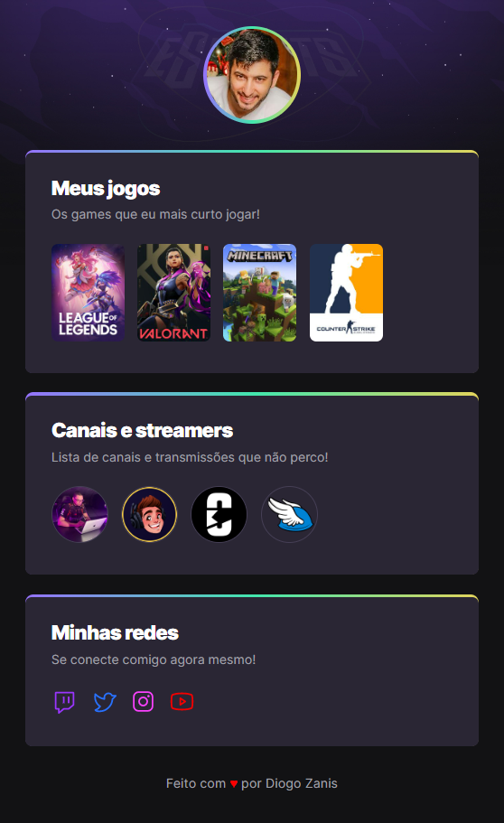

# 🎮 NLW eSportes

> Trilha Explorer

Projeto desenvolvido como exercício durante o evento NLW eSportes, trilha Explorer, que ocorreu entre 11 e 18 de setembro de 2022.

O NLW (Next Level Week) é um evento online de programação na prática da escola Rocketseat.

Esta aplicação é um Game hub, site centralizador de links, no estilo Linktree, feito especialmente para gamers utilizarem na Twitch e outras redes sociais com a proposta de compartilhar quais games e canais acompanham.

[🔗 Acesse aqui](https://dzzanis.github.io/nlw-esportes-explorer)

## 🛠 Tecnologias

- HTML
- CSS
- Git e Github

## 🧡 Contato

zanisdiogo@gmail.com
